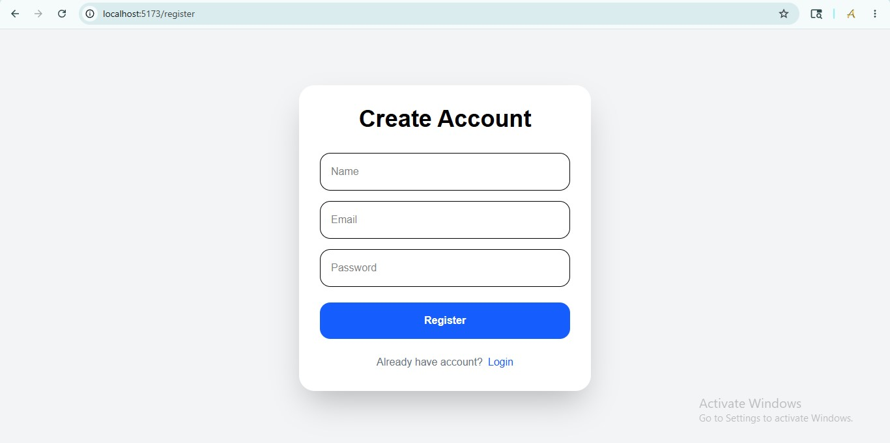
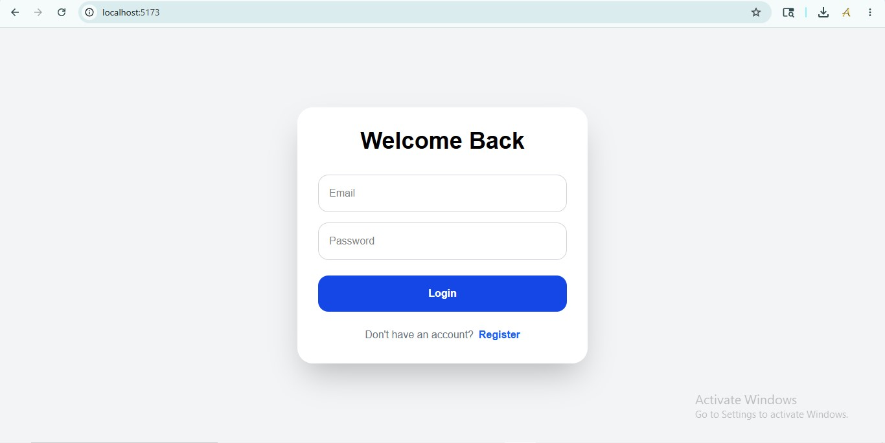
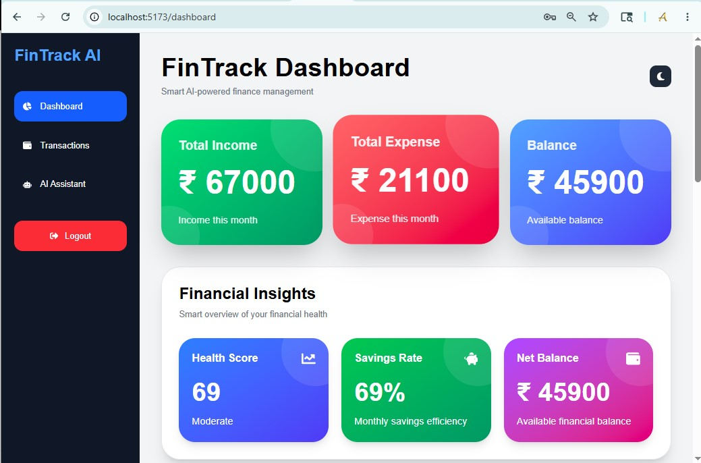
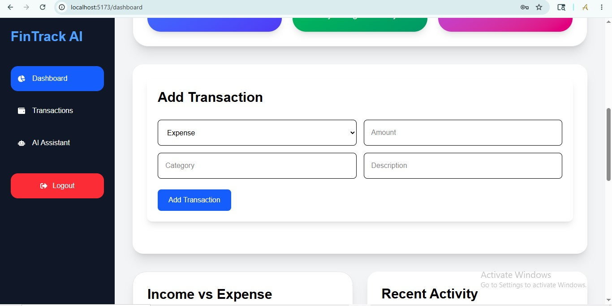
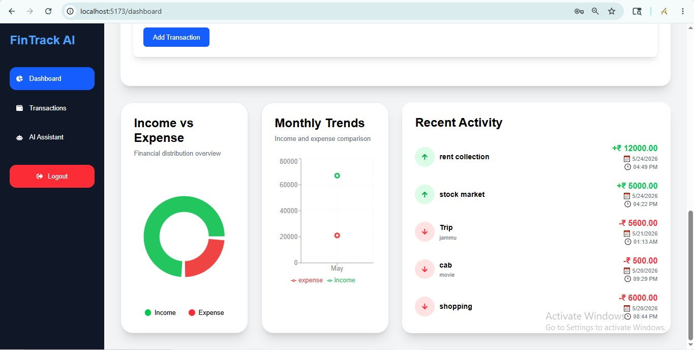
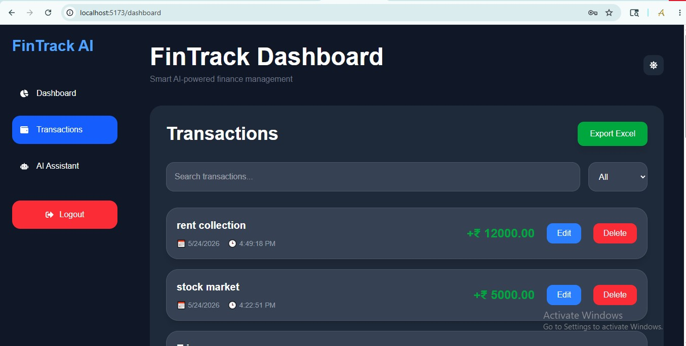
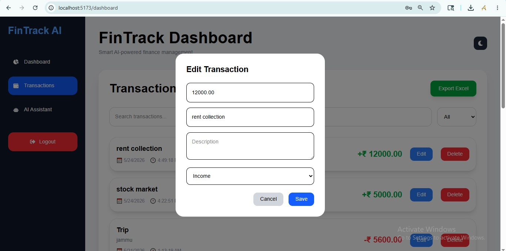
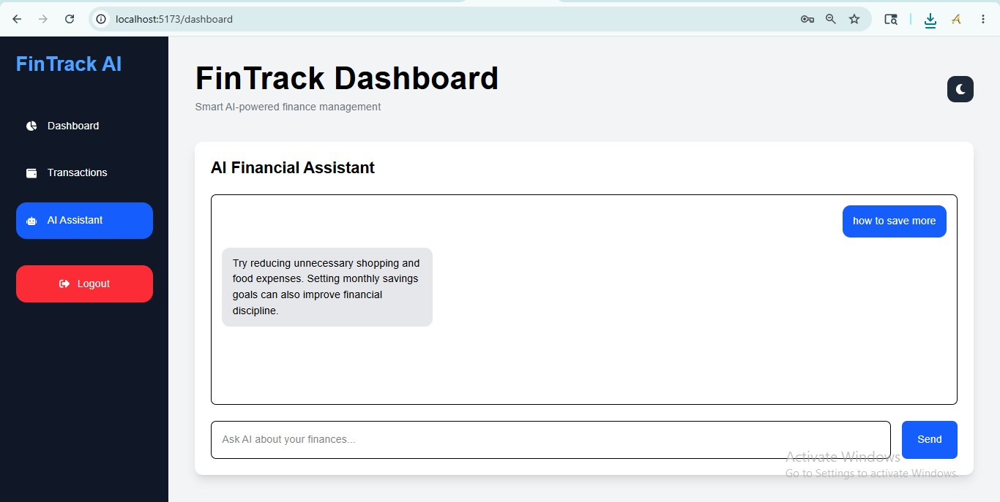

# 🚀 FinTrack AI — Smart Personal Finance Tracker

<div align="center">


### 💰 AI-Powered Full Stack Finance Management Platform

Track expenses, analyze spending, visualize trends, export reports, and interact with an AI financial assistant.

</div>

---

# ✨ Features

## 🔐 Authentication System
✅ User Registration  
✅ User Login  
✅ JWT Authentication  
✅ Protected Routes  
✅ Multi-user Support  
✅ Logout Confirmation Popup  

---

# 💳 Transaction Management

✅ Add Transactions  
✅ Edit Transactions  
✅ Delete Transactions  
✅ Search Transactions  
✅ Filter Transactions  
✅ Real-time Updates  
✅ Date & Time Tracking  

---

# 📊 Advanced Analytics Dashboard

✅ Income vs Expense Analytics  
✅ Monthly Trends Visualization  
✅ Financial Health Insights  
✅ Smart Balance Tracking  
✅ Recent Activity Timeline  
✅ Premium Dashboard Cards  

---

# 🤖 AI Financial Assistant

✅ AI-powered chatbot  
✅ Finance guidance  
✅ Smart financial suggestions  
✅ Gemini AI Integration  

---

# 📁 Export Features

✅ Export Transactions to Excel  
✅ Organized Financial Reports  
✅ Downloadable Data  

---

# 🎨 Premium UI/UX

✅ Fully Responsive Design  
✅ Mobile Friendly  
✅ Tablet Friendly  
✅ Desktop Optimized  
✅ Dark Mode  
✅ Premium Modern UI  
✅ Animated Components  
✅ Sidebar Navigation  
✅ Responsive Charts  

---

# 🛠️ Tech Stack

## Frontend
- React.js
- Tailwind CSS
- Axios
- Recharts
- Framer Motion
- React Hot Toast
- React Icons

## Backend
- Node.js
- Express.js
- JWT Authentication
- bcryptjs

## Database
- MySQL / MariaDB

## AI Integration
- Google Gemini API

---

# 📂 Project Structure

```bash
fintrack-ai/
│
├── backend/
│   ├── config/
│   ├── controllers/
│   ├── middleware/
│   ├── node_modules/
│   ├── routes/
│   ├── services/
│   ├── .env
│   ├── package-lock.json
│   ├── package.json
│   └── server.js
│ 
├── frontend/
│   ├── node_modules/
│   └── public/
│   ├── src/
│   │   ├── assets/
│   │   ├── components/
│   │   ├── App.css
│   │   ├── App.jsx
│   │   ├── Index.jsx
│   │   └── main.jsx
│   │
│   └── 
│
│
└── README.md
```


# 📸 Screenshots


## 🔐 Register Page



---

## 🔐 Login Page



---

## 📊 Dashboard



---

# Add Transaction



---

# 📊 Insights



---


## 💳 Transactions



---

# Edit Transaction



---

## 🤖 AI Assistant


---

# ⚙️ Installation Guide

## 1️⃣ Clone Repository

```bash
git clone https://github.com/Asish7980/fintrack-ai.git
```

---

## 2️⃣ Install Dependencies

### Frontend

```bash
cd frontend
npm install
```

### Backend

```bash
cd backend
npm install
```

---

# 🗄️ Database Setup

## Create Database

```sql
CREATE DATABASE fintrack_ai;
```

---

## Create Users Table

```sql
CREATE TABLE users (
  id VARCHAR(255) PRIMARY KEY,
  email VARCHAR(255) UNIQUE,
  password_hash VARCHAR(255),
  full_name VARCHAR(255),
  avatar_url TEXT,
  role VARCHAR(50) DEFAULT 'user',
  currency VARCHAR(10) DEFAULT 'USD',
  timezone VARCHAR(50) DEFAULT 'UTC',
  theme VARCHAR(20) DEFAULT 'light',
  is_verified BOOLEAN DEFAULT 0,
  is_active BOOLEAN DEFAULT 1,
  created_at TIMESTAMP DEFAULT CURRENT_TIMESTAMP,
  updated_at TIMESTAMP DEFAULT CURRENT_TIMESTAMP
);
```

---

## Create Transactions Table

```sql
CREATE TABLE transactions (
  id VARCHAR(255) PRIMARY KEY,
  user_id VARCHAR(255),
  type VARCHAR(50),
  amount DECIMAL(10,2),
  category VARCHAR(255),
  description TEXT,
  created_at TIMESTAMP DEFAULT CURRENT_TIMESTAMP
);
```

---

# 🔑 Environment Variables

Create `.env` inside backend folder:

```env
PORT=5000

JWT_SECRET=your_secret_key

DB_HOST=localhost
DB_USER=root
DB_PASSWORD=your_password
DB_NAME=fintrack_ai

GEMINI_API_KEY=your_api_key
```

---

# ▶️ Run Application

## Start Backend

```bash
cd backend
npm run dev
```

---

## Start Frontend

```bash
cd frontend
npm run dev
```

---

# 🌐 Application URLs

## Frontend

```txt
http://localhost:5173
```

## Backend

```txt
http://localhost:5000
```

---

# 📸 Application Modules

## 🔹 Login Page
- Secure JWT Authentication
- Responsive UI
- Toast Notifications

## 🔹 Dashboard
- Financial Summary
- Advanced Charts
- AI Insights
- Recent Activity

## 🔹 Transactions
- Add/Edit/Delete
- Search & Filter
- Export Excel
- Responsive Table

## 🔹 AI Assistant
- Smart Finance Chat
- Gemini AI Integration

---

# 🔥 Major Highlights

✅ Full Stack Project  
✅ Production-style Architecture  
✅ Responsive Fintech UI  
✅ Real Database Integration  
✅ Authentication System  
✅ AI Integration  
✅ Export Features  
✅ Premium Dashboard  

---

# 👨‍💻 Author

## Asish Shaw

GitHub:
https://github.com/Asish7980

---

# 🚀 Future Improvements

- Budget Planning
- Expense Category Analytics
- PDF Export
- Cloud Deployment
- AI Expense Prediction
- Voice Assistant
- Notifications System
- Multi Currency Support

---

# ⭐ Support

If you like this project:

⭐ Star the repository  
🍴 Fork the repository  

---

# 📜 License

This project is licensed under the MIT License.
